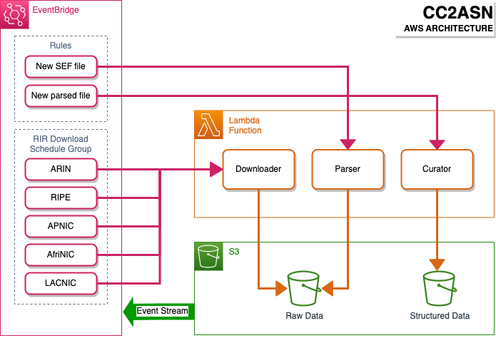

CC2ASN
======

A lookup service for AS-numbers and prefixes belonging to any given country in 
the world. Simply provide country codes as input and you’ll get all ASNs, IPv4 
or IPv6 addresses registered to that country. For more detailed information 
check out the website at [www.cc2asn.com][1].

> **Note:**
> If you're only interested in the CC2ASN data simply use the service as 
> described on [cc2asn.com][1]

This is the redesigned event driven architecure for CC2ASN. If you are looking
for the legacy server based version, then go 

Architecture
------------

[1]: http://www.cc2asn.com
                                              
